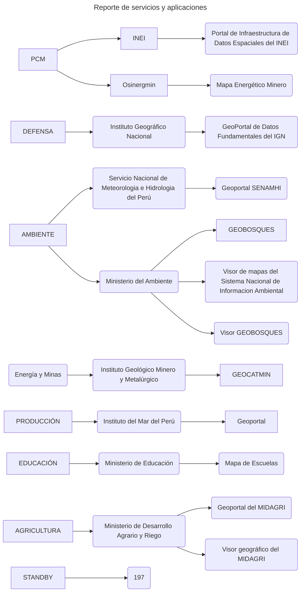

# [Reporte de servicios y aplicaciones del gobierno Peruano](https://www.geoidep.gob.pe/reporte-de-servicios-y-aplicaciones)

```mermaid
---
title: Reporte de servicios y aplicaciones
---
flowchart LR
PCM-->INEI
INEI-->C(Portal de Infraestructura de Datos Espaciales del INEI)
PCM-->Osinergmin
Osinergmin-->D(Mapa Energético Minero)
DEFENSA-->E(Instituto Geográfico Nacional)
E-->F(GeoPortal de Datos Fundamentales del IGN)
AMBIENTE-->G(Servicio Nacional de Meteorologia e Hidrologia del Perú)
G-->H(Geoportal SENAMHI)
I(Energía y Minas)-->J(Instituto Geológico Minero y Metalúrgico)
J-->GEOCATMIN
PRODUCCIÓN-->K(Instituto del Mar del Perú)
K-->Geoportal
AMBIENTE-->L(Ministerio del Ambiente)
L-->GEOBOSQUES
L-->M(Visor de mapas del Sistema Nacional de Informacion Ambiental)
L-->N(Visor GEOBOSQUES)
EDUCACIÓN-->O(Ministerio de Educación)
O-->P(Mapa de Escuelas)
AGRICULTURA-->Q(Ministerio de Desarrollo Agrario y Riego)
Q-->R(Geoportal del MIDAGRI)
Q-->S(Visor geográfico del MIDAGRI)
STANDBY-->AA(197)

click C "https://ide.inei.gob.pe/"
click D "http://gisem.osinergmin.gob.pe/menergetico/"
click F "https://www.idep.gob.pe/"
click H "http://idesep.senamhi.gob.pe/geovisoridesep"
click GEOCATMIN "https://geocatmin.ingemmet.gob.pe/geocatmin/main"
click Geoportal "https://satelite.imarpe.gob.pe/#/"
click GEOBOSQUES "http://geobosques.minam.gob.pe/geobosque/view/index.php"
click M "https://sinia.minam.gob.pe/indicadores-estadisticas"
click N "http://geobosques.minam.gob.pe/geobosque/visor/"
click P "http://sigmed.minedu.gob.pe/mapaeducativo/"
click R "https://geo.midagri.gob.pe/"
click S "https://geovisor.midagri.gob.pe/"

```